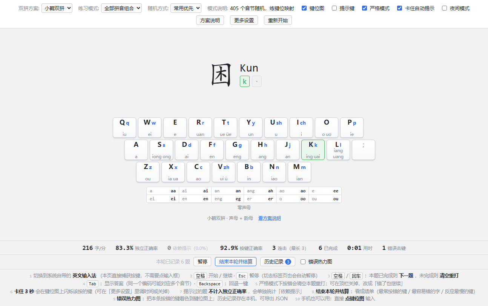
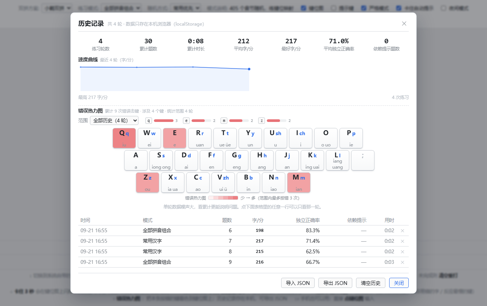

# 双拼练习系统

一个可以长期日常使用的**小鹤双拼**打字练习网页应用。七种练习模式、卡住自动提示、
错误热力图、历史复盘与易错复习，还能打包成**双击就能用的单文件 HTML**（不装、不联网、不要服务器）。

[](LICENSE)
[](https://github.com/z1803406304/shuangpin-practice/actions/workflows/ci.yml)
[](package.json)
[](https://vuejs.org/)
[](https://vite.dev/)



## 特性

- **七种练习模式**：全部拼音组合 / 常用汉字 / 词组 / 句子短文 / 自定义文本 / 键位记忆训练 / 易错复习
- **卡住自动提示**：一个键想不出来，干等 3 秒就在键位图上闪该按的键；提示过的题不计入独立正确率
- **开始 / 暂停**：准备阶段和离开电脑时不计时、不计错、不误触发提示
- **错误热力图**：实时看本轮，历史面板看**多轮累计**（长期哪些键没记牢）
- **数据驱动的题库**：405 音节按真实字频加权、3500 常用字、12000 常用词、1200 四字词/成语
- **键盘布局无关**：用 `KeyboardEvent.code`（物理键位）判定，Dvorak 等布局也能用
- **离线单文件**：`npm run release` 出一个 892 KB 的 HTML，拷到任何地方双击即用
- **无需后端**：所有数据都在仓库里，运行时不联网；练习记录存本机 localStorage，可导出/导入 JSON

## 快速开始

```bash
git clone https://github.com/z1803406304/shuangpin-practice.git
cd shuangpin-practice
npm install
npm run dev          # → http://localhost:5273/
```

需要 **Node.js >= 22.18**（测试是 `.mjs` 直接 import `.ts` 源码，依赖原生 TypeScript 类型剥离）。
开发与 CI 使用 Node 24。

> **Windows / PowerShell 用户注意**
>
> PowerShell 默认的执行策略是 `Restricted`（禁止运行任何脚本），所以直接敲 `npm` 会报
> 「无法加载文件 …npm.ps1，因为在此系统上禁止运行脚本」。三种解法任选：
>
> ```powershell
> # 1) 用 npm.cmd 绕过（立刻可用，不改系统设置）
> npm.cmd install
> npm.cmd run dev
>
> # 2) 一次性放开当前用户的策略（推荐；本地脚本放行，从网上下载的脚本仍需签名）
> Set-ExecutionPolicy -Scope CurrentUser -ExecutionPolicy RemoteSigned
>
> # 3) 只在本会话临时放开（关掉终端就恢复）
> Set-ExecutionPolicy -Scope Process -ExecutionPolicy Bypass
> ```
>
> 另外：所有脚本也可以直接用 `node` 跑，例如 `node scripts/verify-file-url.mjs`。

### 打包成双击就能用的单文件

```bash
npm run release
# → release/双拼练习.html（892 KB）
```

拷到 U 盘、网盘、发给别人都行，**双击即用**：不需要安装、不需要服务器、不需要联网。
手机上也可以（传文件用浏览器打开，或 `npm run preview -- --host` 后访问局域网地址）。

## 七种练习模式

| 模式 | 练什么 | 题面 |
| --- | --- | --- |
| **全部拼音组合** | 405 个音节的键位映射 | 单字 + 拼音 |
| **常用汉字** | 看到字直接反应出键位（可选前 300/500/1000/2000/3500 常用字） | 单字 + 拼音 |
| **词组** | 连续切换键位组合，含词内多音字（范围可选 1000/3000/6000/全部 12000，或四字词/成语专项） | 词，逐字推进 |
| **句子 / 短文** | 最接近真实打字：整句显示、逐字高亮 | 335 条语料（覆盖前 500 常用字的 98%） |
| **自定义文本** | 练自己的材料（文章、单词表、工作术语） | 粘贴文本，自动切段 |
| **键位记忆训练** | 只按一个键的专项：韵母→键 / 声母→键 / 音节→声母键 / 音节→韵母键 | 单键题 |
| **易错复习** | 只练你按错过的字（历史累计 + 本轮，按错误次数加权） | 单字 + 错误次数提示 |

「键位记忆训练」是给初学的第一阶段用的：完整音节练习里一个字的错误分不清是
「声母想不起来」还是「韵母记错了」，这个模式把两部分拆开，配合结算面板的
「反应最慢的键」能精确定位到具体哪个韵母没记住。

## 怎么练

1. **按 `空格` 开始**。页面加载后是「未开始」状态：题面和键位图先显示出来，
   你可以先切输入法、看看键位图，这期间的误触不会被记成错误
2. 切换到系统自带的**英文输入法**（页面直接捕获按键，不需要点任何输入框）
3. `空格` / `回车`：本题已完成 → 下一题；未完成 → 清空重打
4. `Tab`：显示答案 · `Backspace`：回退一个键 · `Esc`：暂停
5. 手机/触屏：直接**点键位图**输入

### 开始 / 暂停

| 操作 | 效果 |
| --- | --- |
| `空格` | 从「未开始 / 已暂停」进入练习 |
| `Esc` | 暂停 |
| 切走标签页 | 自动暂停 |
| 长时间没输入（默认 60 秒，可调可关） | 自动暂停 |

暂停期间不接收输入、不计入用时，卡住提示也不触发。

「离开较久」触发的自动暂停（含切走标签页），继续时本题重新开始：
那段时间里闪过的提示不算你看过，否则这道题会被记成「依赖提示」而不再计入独立成绩。

### 卡住自动提示

一个键想不出来、干等 **3 秒**，键位图上会闪烁该按的键，敲键后重新计时。
默认只闪键位、不给答案；想直接看答案按 `Tab`，或在「更多设置」里打开「6 秒后显示答案」。

提示过的题不计入独立正确率，单独统计为「依赖提示」。

## 统计与复盘

- **结束本轮并结算**：成绩单含速度、独立正确率、按键正确率、最长连击，以及
  **最常按错的键**（手滑/记混）、**最容易错的字**（重点复习）、**反应最慢的键**（还没记牢）
- **错误热力图**：本轮按错的键按次数着色到键位图上
- **历史记录**：练习轮数、累计题数/时长、平均与最好速度、**速度曲线**、
  **多轮累计热力图**、逐轮明细，支持**导入 / 导出 JSON**、单条删除、清空（两步确认）



单轮数据噪声太大（一轮里按错 2 次可能只是手滑），所以历史热力图是**多轮累计**的，
范围可以切「全部历史 / 最近 30 轮 / 最近 10 轮」，**点表格里任意一行**还能只看那一轮。

**换电脑怎么办**：旧机器「导出 JSON」→ 新机器「导入 JSON」。
导入是两步确认的（先显示找到几条记录，再选合并或替换），
合并按 id 去重，所以**同一份文件导入两次不会翻倍**。

## 正确性怎么保证的

双拼练习器最容易出错的地方是「键位表写错」，而写错了用户会跟着练错。
所以这个项目的正确性不靠肉眼核对，靠三层验证：

| 层次 | 做法 | 结果 |
| --- | --- | --- |
| 单测 | 手写 ~90 条权威用例 + 405 音节全量回归 + 提示策略 + 统计 + 历史 + 题库与语料质量 + 出题器 + 状态机 | `npm test` **81/81** |
| 交叉验证 | 下载**小鹤官方码表**，对每个单字取官方编码前两位与我们的编码器逐字比对 | **7674/7701 一致（99.649%）** |
| 端到端 | 用无头浏览器在真 `file://` 下跑完整流程（渲染、按键、暂停、刷新持久化、按需加载） | **19/19** |

那 27 处不一致经解码确认**全部是生僻多音字的读音取舍差异**
（例如 蔈：官方 `bn`→biao，我们 `pn`→piao），不是编码错误。

```bash
npm run verify:flypy   # 官方码表交叉验证
npm run verify:file    # 真 file:// 端到端验证（用系统里的 Chrome/Edge）
```

## 项目结构

```
src/
  core/                     # 纯逻辑层：零 DOM、零框架，可直接在 Node 里跑测试
    schemes/xiaohe.ts       #   小鹤键位表 + 编码器 + 反向解码
    schemes/index.ts        #   方案注册表（加方案 = 加一个文件）
    judge.ts                #   逐键判定状态机（严格 / 宽松，支持 1~2 键的题）
    hint.ts                 #   卡住自动提示的策略（纯函数，无定时器）
    session-phase.ts        #   未开始 / 进行中 / 已暂停 状态机
    stats.ts                #   速度 / 正确率 / 连击 / 错误键 / 每键反应时间 / 依赖提示
    history.ts              #   历史记录结构、汇总、多轮聚合、坏数据容错
    text.ts                 #   题面与音节对齐（标点处理）
    keys.ts / sound.ts      #   键码工具 / WebAudio 音效
  data/                     # 生成产物（勿手改，见 npm run gen:all）
    syllables.ts            #   405 个音节 + 代表字 + 常用度权重
    hanzi.ts                #   3500 个常用汉字（按字频）
    words.ts                #   12000 个常用词语（含音节）
    sentences.ts            #   335 条句子 / 短文（含音节）
  generators/               # 出题器：统一接口，加模式 = 加一个文件
  stores/                   # settings / session / history / customTexts / ui
  components/               # 界面组件
corpus/sentences.txt        # 句子语料源文件（自己改完跑 npm run gen:corpus）
scripts/                    # 数据生成、编码器交叉验证、离线打包、截图
tests/                      # 8 个测试文件，纯 Node
docs/DESIGN.md              # 设计取舍与实施记录（每个决策的理由、遇到的问题）
```

**设计要点**：

1. `core/` 是纯函数层（不依赖 DOM / Vue / pinyin-pro），所以「双拼对不对」这件事能靠测试兜底
2. 一份键位表同时驱动**编码器**和**键位图渲染**，所以「图上标的」和「程序判的」不可能不一致
3. 拼音只在构建期算（词/句）或按需加载（自定义文本），所以首屏不需要那个 300KB 的拼音库

更多设计取舍见 [`docs/DESIGN.md`](docs/DESIGN.md)。

## 数据来源与筛选

| 数据 | 来源 | 用途 |
| --- | --- | --- |
| 汉字读音 | [pinyin-pro](https://github.com/zh-lx/pinyin-pro)（MIT） | 汉字 → 声母/韵母 |
| 字频 | [ruddfawcett/hanziDB.csv](https://github.com/ruddfawcett/hanziDB.csv)（MIT，Jun Da 现代汉语字频表） | 代表字挑选 + 音节常用度权重 + 常用汉字模式 |
| 词频与词性 | [jieba 词典](https://github.com/fxsjy/jieba)（MIT） | 12000 个常用词语 |
| 繁简转换 | [opencc-js](https://github.com/nk2028/opencc-js)（MIT） | 生成期剔除繁体重复词 |
| 官方码表 | [ITX-Snowhare/flypy-codetable](https://github.com/ITX-Snowhare/flypy-codetable)（未标注许可） | **只用于开发期交叉验证，不随包分发** |
| 句子语料 | 本项目手写（`corpus/sentences.txt`） | 335 条句子 / 短文 |

数据在生成期下载到 `data-src/`（已 gitignore，可随时重下），产物提交进仓库，**运行时不联网**。

**词库筛选**：jieba 词典有 58 万条。三道过滤：按词性剔除人名/地名/机构/专名、
用 opencc 去掉繁体重复项、要求每个字都在常用字表内。成语单独放宽词频门槛，并保留 1200 个名额。

**语料按覆盖率扩充**：`npm run gen:corpus` 会列出前 1000 常用字中尚未覆盖的字，按那个清单补句子。
当前 335 条覆盖前 500 常用字的 **98%**、前 1000 的 **71%**，并有测试锁住下限（低于 95% / 68% 会失败）。

**体积**：数据文件合计 571 KB（gzip 145 KB），主包因此约 190 KB gzip。
对本地运行没影响，所以默认不拆包；如果以后要挂到网站上，
把 `data/words.ts` 改成按需 `import()` 就能把主包压回约 70 KB
（`vite.config.ts` 里写了具体位置和理由）。

## 开发

```bash
npm test               # 全部单测（81 个，纯 Node，不需要浏览器）
npm run typecheck      # vue-tsc
npm run build          # 构建
npm run gen:all        # 重新生成音节表 / 常用字 / 词库 / 句子
npm run make:screenshot # 重新生成 README 截图（需要先 npm run dev）
```

改动前请读一下 [CONTRIBUTING.md](CONTRIBUTING.md)：里面有项目约定
（`core/` 保持纯函数、不要手改生成产物、涉及中文文本的编码注意事项、
加双拼方案 / 加练习模式的步骤）。

## 已知限制

- **只实现了小鹤双拼一种方案**。加方案 = 在 `core/schemes/` 加一个文件 + 注册，
  但要注意 `initialsOfKey()` 目前写在 `xiaohe.ts` 里，加方案时得按方案拆开
- 键位训练只有「→ 键」方向；反向（给键选韵母）答案是文字、不适合打字式界面，
  但 `decodeLetters()` 已实现，要做选择题型可以直接用
- 历史记录存在浏览器本机，**换浏览器或清理浏览器数据会丢**（请定期导出 JSON）
- 词库/语料是离线快照，改语料要重跑 `npm run gen:corpus`
- 普通构建产物是 ES module，不能双击打开；要双击用 `npm run build:offline`
- `typescript` 锁在 `^5.9`：TS 7 不再导出 `typescript/lib/tsc`，`vue-tsc` 无法工作

## 许可证

[MIT](LICENSE) © 2026 yummy

### 第三方数据与商标说明

- 代码依赖（Vue / Vite / pinyin-pro / opencc-js）与字频、词频数据均为 **MIT**，与本项目兼容。
- 字频表的原始数据来自 Jun Da 的现代汉语字频表（学术数据集，本身未单独声明许可），
  `hanziDB.csv` 是其 MIT 授权的整理版本。
- **小鹤官方码表未标注许可证**，因此它只用于开发期的交叉验证脚本，
  **码表数据没有进入本仓库的产物**。
- 「小鹤双拼」是其权利人的输入法方案名称，本项目是**独立的第三方练习工具**，
  与其权利人无关联。键位映射属事实性内容；如果你要商用或再分发，建议自行确认方案名称与键位图的使用条件。
